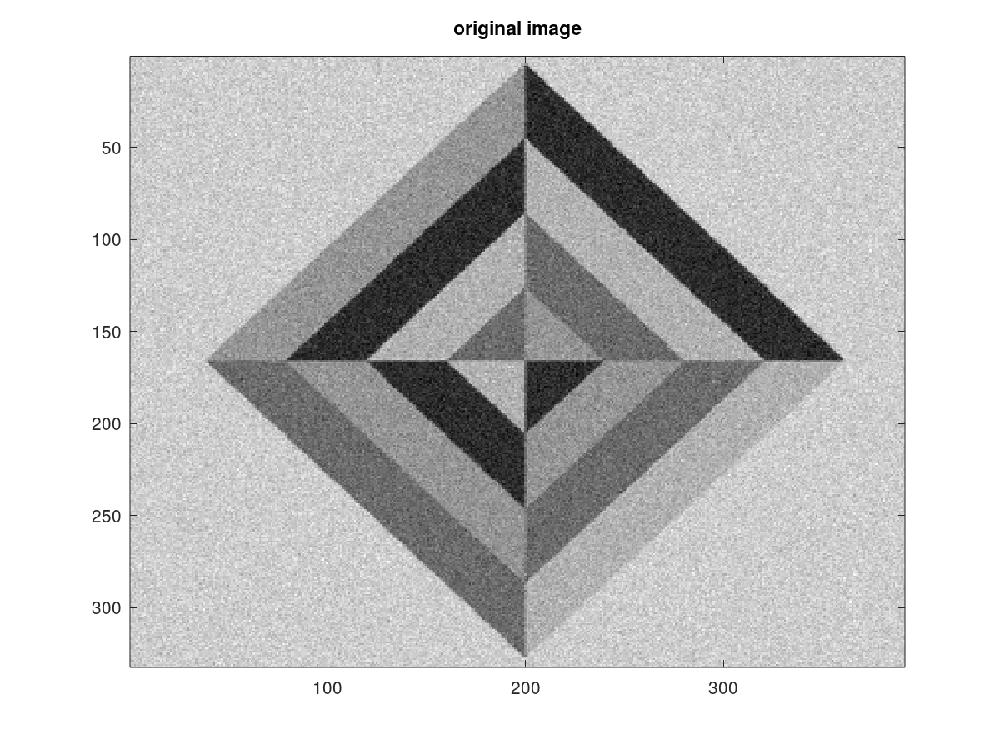
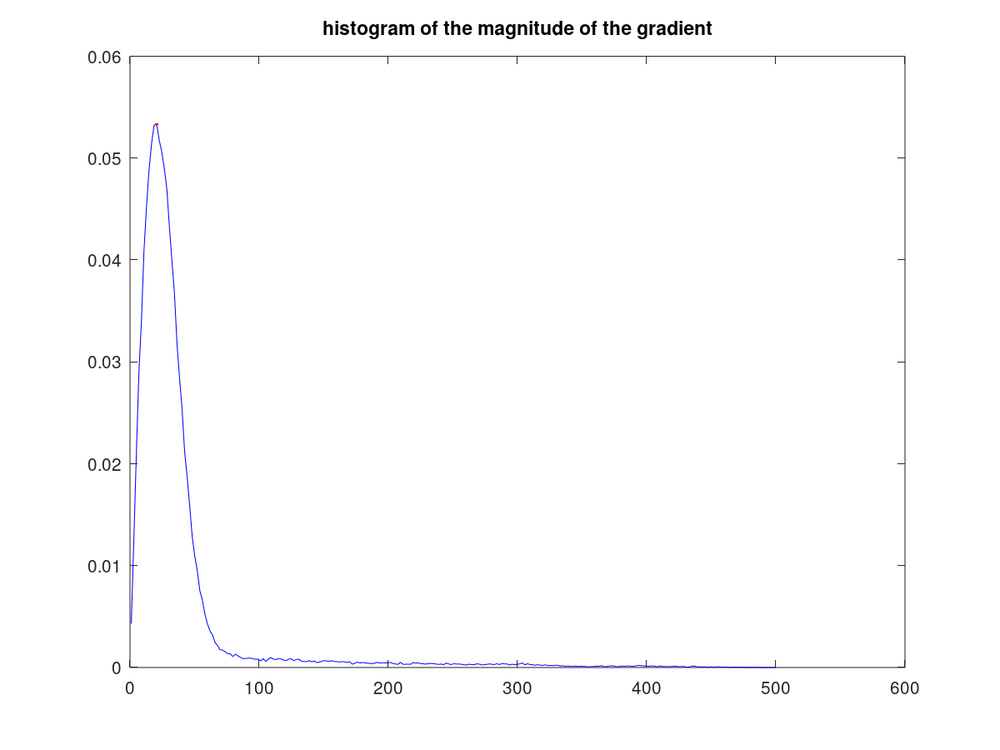
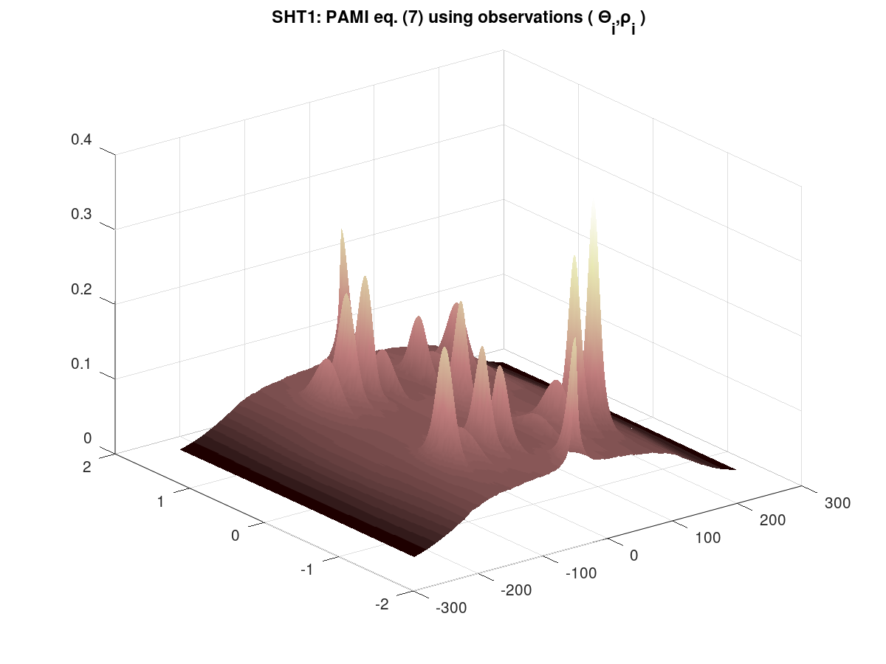
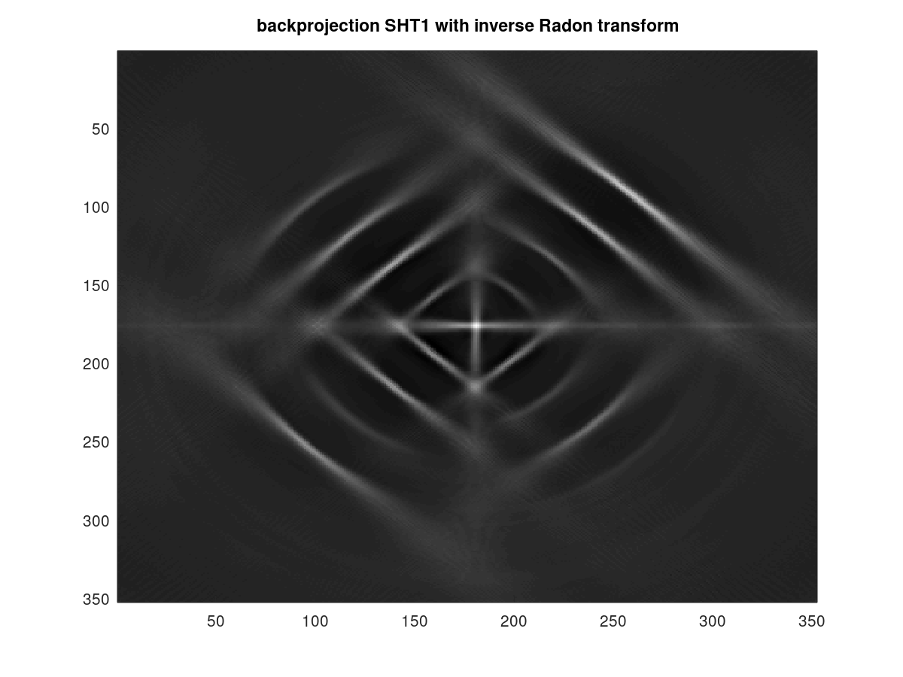
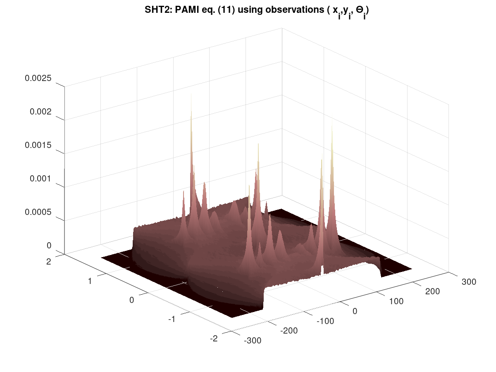
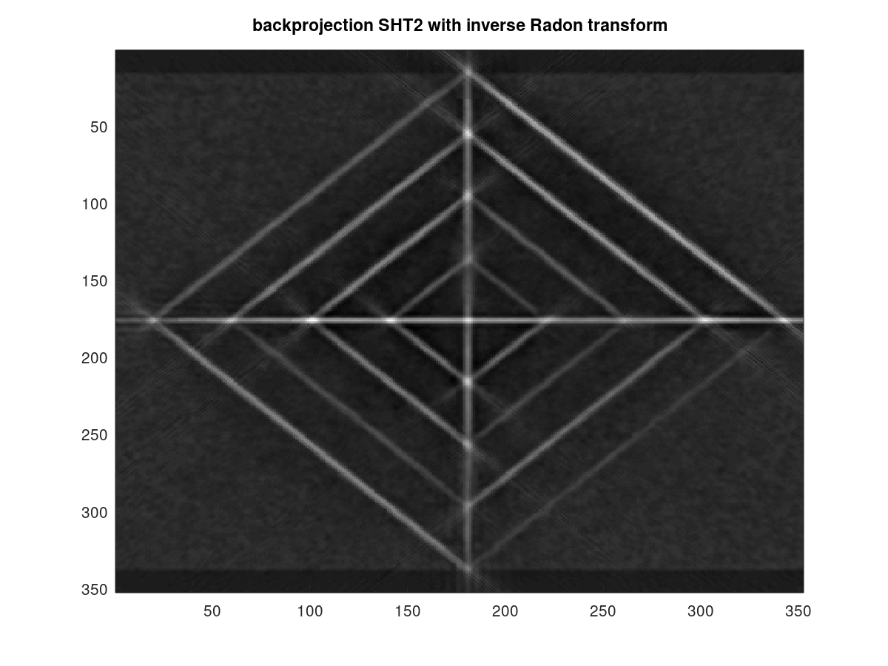
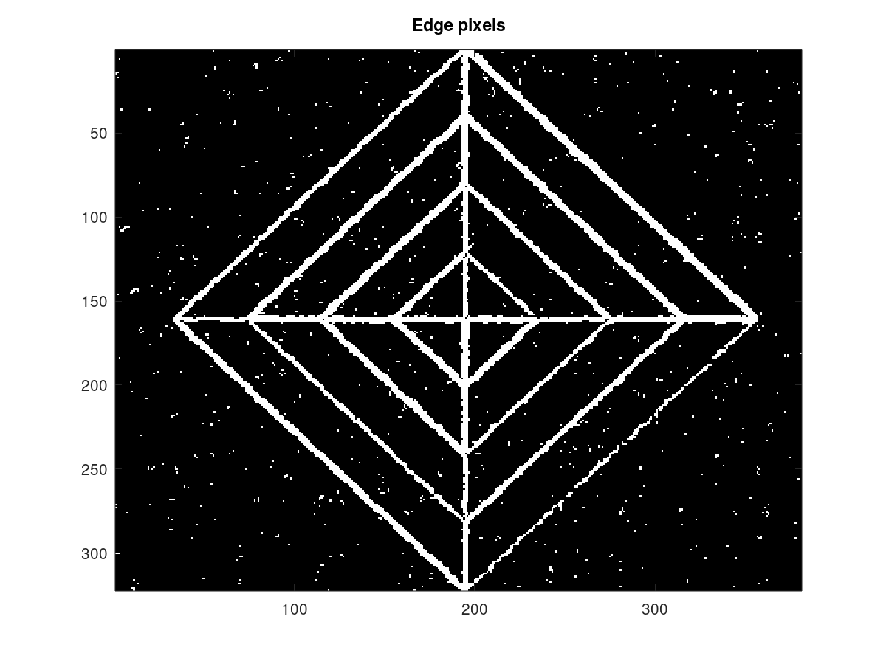
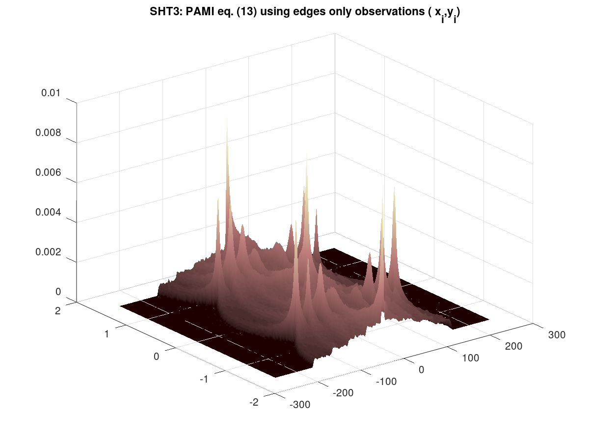
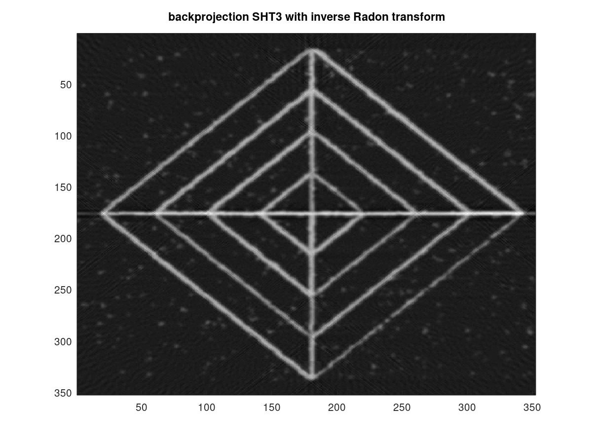

# PAMI-2009: Statistical Hough Transform

This package contains  Matlab and Octave code associated with the following publication: 

> Statistical Hough Transform, 
R. Dahyot, 
in IEEE transactions on Pattern Analysis and Machine Intelligence, 
pages 1502-1509, Vol. 31, No. 8, August 2009. 
DOI:10.1109/TPAMI.2008.288

See [Preprint](http://www.tara.tcd.ie/handle/2262/31106)  or [DOI:10.1109/TPAMI.2008.288](http://dx.doi.org/10.1109/TPAMI.2008.288)

Please cite this PAMI journal paper when using this code and pictures.

## Getting started in Matlab

Demo is launched by typing in the command window of Matlab:

> RzDDemoPAMI2009 

The image *losange3.bmp* needs to be placed in the same folder as this *RzDDemoPAMI2009.m* file.

## Getting started in Octave

Demo is launched by typing in the command window of Octave:

> RzDDemoPAMI2009Octave 

The image *losange3.bmp* needs to be placed in the same folder as this *RzDDemoPAMI2009Octave.m* file.

## Outputs

Time reported in the Command Window are just indicative.

         

## Author and Repo webpage 

- [Repo Webpage](https://roznn.github.io/Statistical-Hough-Transform/)
- [Rozenn Dahyot](https://roznn.github.io/)

